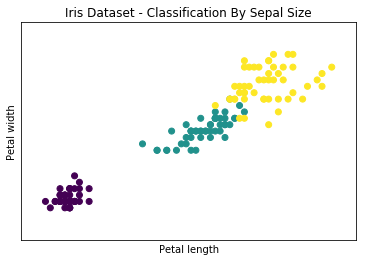
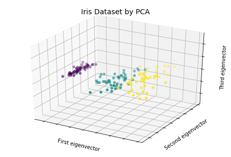
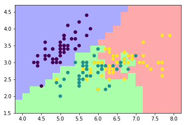

<script type="text/javascript" async src="https://cdn.mathjax.org/mathjax/latest/MathJax.js?config=TeX-MML-AM_CHTML"></script>


```python
from sklearn import datasets
```


```python
iris = datasets.load_iris()
```


```python
iris.data
```


    array([[ 5.1,  3.5,  1.4,  0.2],
           [ 4.9,  3. ,  1.4,  0.2],
           [ 4.7,  3.2,  1.3,  0.2],
           [ 4.6,  3.1,  1.5,  0.2],
           [ 5. ,  3.6,  1.4,  0.2],
           [ 5.4,  3.9,  1.7,  0.4],
           [ 4.6,  3.4,  1.4,  0.3],
           [ 5. ,  3.4,  1.5,  0.2],
           [ 4.4,  2.9,  1.4,  0.2],
           [ 4.9,  3.1,  1.5,  0.1],
           [ 5.4,  3.7,  1.5,  0.2],
           [ 4.8,  3.4,  1.6,  0.2],
           [ 4.8,  3. ,  1.4,  0.1],
           [ 4.3,  3. ,  1.1,  0.1],
           [ 5.8,  4. ,  1.2,  0.2],
           [ 5.7,  4.4,  1.5,  0.4],
           [ 5.4,  3.9,  1.3,  0.4],
           [ 5.1,  3.5,  1.4,  0.3],
           [ 5.7,  3.8,  1.7,  0.3],
           [ 5.1,  3.8,  1.5,  0.3],
           [ 5.4,  3.4,  1.7,  0.2],
           [ 5.1,  3.7,  1.5,  0.4],
           [ 4.6,  3.6,  1. ,  0.2],
           [ 5.1,  3.3,  1.7,  0.5],
           [ 4.8,  3.4,  1.9,  0.2],
           [ 5. ,  3. ,  1.6,  0.2],
           [ 5. ,  3.4,  1.6,  0.4],
           [ 5.2,  3.5,  1.5,  0.2],
           [ 5.2,  3.4,  1.4,  0.2],
           [ 4.7,  3.2,  1.6,  0.2],
           [ 4.8,  3.1,  1.6,  0.2],
           [ 5.4,  3.4,  1.5,  0.4],
           [ 5.2,  4.1,  1.5,  0.1],
           [ 5.5,  4.2,  1.4,  0.2],
           [ 4.9,  3.1,  1.5,  0.1],
           [ 5. ,  3.2,  1.2,  0.2],
           [ 5.5,  3.5,  1.3,  0.2],
           [ 4.9,  3.1,  1.5,  0.1],
           [ 4.4,  3. ,  1.3,  0.2],
           [ 5.1,  3.4,  1.5,  0.2],
           [ 5. ,  3.5,  1.3,  0.3],
           [ 4.5,  2.3,  1.3,  0.3],
           [ 4.4,  3.2,  1.3,  0.2],
           [ 5. ,  3.5,  1.6,  0.6],
           [ 5.1,  3.8,  1.9,  0.4],
           [ 4.8,  3. ,  1.4,  0.3],
           [ 5.1,  3.8,  1.6,  0.2],
           [ 4.6,  3.2,  1.4,  0.2],
           [ 5.3,  3.7,  1.5,  0.2],
           [ 5. ,  3.3,  1.4,  0.2],
           [ 7. ,  3.2,  4.7,  1.4],
           [ 6.4,  3.2,  4.5,  1.5],
           [ 6.9,  3.1,  4.9,  1.5],
           [ 5.5,  2.3,  4. ,  1.3],
           [ 6.5,  2.8,  4.6,  1.5],
           [ 5.7,  2.8,  4.5,  1.3],
           [ 6.3,  3.3,  4.7,  1.6],
           [ 4.9,  2.4,  3.3,  1. ],
           [ 6.6,  2.9,  4.6,  1.3],
           [ 5.2,  2.7,  3.9,  1.4],
           [ 5. ,  2. ,  3.5,  1. ],
           [ 5.9,  3. ,  4.2,  1.5],
           [ 6. ,  2.2,  4. ,  1. ],
           [ 6.1,  2.9,  4.7,  1.4],
           [ 5.6,  2.9,  3.6,  1.3],
           [ 6.7,  3.1,  4.4,  1.4],
           [ 5.6,  3. ,  4.5,  1.5],
           [ 5.8,  2.7,  4.1,  1. ],
           [ 6.2,  2.2,  4.5,  1.5],
           [ 5.6,  2.5,  3.9,  1.1],
           [ 5.9,  3.2,  4.8,  1.8],
           [ 6.1,  2.8,  4. ,  1.3],
           [ 6.3,  2.5,  4.9,  1.5],
           [ 6.1,  2.8,  4.7,  1.2],
           [ 6.4,  2.9,  4.3,  1.3],
           [ 6.6,  3. ,  4.4,  1.4],
           [ 6.8,  2.8,  4.8,  1.4],
           [ 6.7,  3. ,  5. ,  1.7],
           [ 6. ,  2.9,  4.5,  1.5],
           [ 5.7,  2.6,  3.5,  1. ],
           [ 5.5,  2.4,  3.8,  1.1],
           [ 5.5,  2.4,  3.7,  1. ],
           [ 5.8,  2.7,  3.9,  1.2],
           [ 6. ,  2.7,  5.1,  1.6],
           [ 5.4,  3. ,  4.5,  1.5],
           [ 6. ,  3.4,  4.5,  1.6],
           [ 6.7,  3.1,  4.7,  1.5],
           [ 6.3,  2.3,  4.4,  1.3],
           [ 5.6,  3. ,  4.1,  1.3],
           [ 5.5,  2.5,  4. ,  1.3],
           [ 5.5,  2.6,  4.4,  1.2],
           [ 6.1,  3. ,  4.6,  1.4],
           [ 5.8,  2.6,  4. ,  1.2],
           [ 5. ,  2.3,  3.3,  1. ],
           [ 5.6,  2.7,  4.2,  1.3],
           [ 5.7,  3. ,  4.2,  1.2],
           [ 5.7,  2.9,  4.2,  1.3],
           [ 6.2,  2.9,  4.3,  1.3],
           [ 5.1,  2.5,  3. ,  1.1],
           [ 5.7,  2.8,  4.1,  1.3],
           [ 6.3,  3.3,  6. ,  2.5],
           [ 5.8,  2.7,  5.1,  1.9],
           [ 7.1,  3. ,  5.9,  2.1],
           [ 6.3,  2.9,  5.6,  1.8],
           [ 6.5,  3. ,  5.8,  2.2],
           [ 7.6,  3. ,  6.6,  2.1],
           [ 4.9,  2.5,  4.5,  1.7],
           [ 7.3,  2.9,  6.3,  1.8],
           [ 6.7,  2.5,  5.8,  1.8],
           [ 7.2,  3.6,  6.1,  2.5],
           [ 6.5,  3.2,  5.1,  2. ],
           [ 6.4,  2.7,  5.3,  1.9],
           [ 6.8,  3. ,  5.5,  2.1],
           [ 5.7,  2.5,  5. ,  2. ],
           [ 5.8,  2.8,  5.1,  2.4],
           [ 6.4,  3.2,  5.3,  2.3],
           [ 6.5,  3. ,  5.5,  1.8],
           [ 7.7,  3.8,  6.7,  2.2],
           [ 7.7,  2.6,  6.9,  2.3],
           [ 6. ,  2.2,  5. ,  1.5],
           [ 6.9,  3.2,  5.7,  2.3],
           [ 5.6,  2.8,  4.9,  2. ],
           [ 7.7,  2.8,  6.7,  2. ],
           [ 6.3,  2.7,  4.9,  1.8],
           [ 6.7,  3.3,  5.7,  2.1],
           [ 7.2,  3.2,  6. ,  1.8],
           [ 6.2,  2.8,  4.8,  1.8],
           [ 6.1,  3. ,  4.9,  1.8],
           [ 6.4,  2.8,  5.6,  2.1],
           [ 7.2,  3. ,  5.8,  1.6],
           [ 7.4,  2.8,  6.1,  1.9],
           [ 7.9,  3.8,  6.4,  2. ],
           [ 6.4,  2.8,  5.6,  2.2],
           [ 6.3,  2.8,  5.1,  1.5],
           [ 6.1,  2.6,  5.6,  1.4],
           [ 7.7,  3. ,  6.1,  2.3],
           [ 6.3,  3.4,  5.6,  2.4],
           [ 6.4,  3.1,  5.5,  1.8],
           [ 6. ,  3. ,  4.8,  1.8],
           [ 6.9,  3.1,  5.4,  2.1],
           [ 6.7,  3.1,  5.6,  2.4],
           [ 6.9,  3.1,  5.1,  2.3],
           [ 5.8,  2.7,  5.1,  1.9],
           [ 6.8,  3.2,  5.9,  2.3],
           [ 6.7,  3.3,  5.7,  2.5],
           [ 6.7,  3. ,  5.2,  2.3],
           [ 6.3,  2.5,  5. ,  1.9],
           [ 6.5,  3. ,  5.2,  2. ],
           [ 6.2,  3.4,  5.4,  2.3],
           [ 5.9,  3. ,  5.1,  1.8]])


```python
iris.target
```


    array([0, 0, 0, 0, 0, 0, 0, 0, 0, 0, 0, 0, 0, 0, 0, 0, 0, 0, 0, 0, 0, 0, 0,
           0, 0, 0, 0, 0, 0, 0, 0, 0, 0, 0, 0, 0, 0, 0, 0, 0, 0, 0, 0, 0, 0, 0,
           0, 0, 0, 0, 1, 1, 1, 1, 1, 1, 1, 1, 1, 1, 1, 1, 1, 1, 1, 1, 1, 1, 1,
           1, 1, 1, 1, 1, 1, 1, 1, 1, 1, 1, 1, 1, 1, 1, 1, 1, 1, 1, 1, 1, 1, 1,
           1, 1, 1, 1, 1, 1, 1, 1, 2, 2, 2, 2, 2, 2, 2, 2, 2, 2, 2, 2, 2, 2, 2,
           2, 2, 2, 2, 2, 2, 2, 2, 2, 2, 2, 2, 2, 2, 2, 2, 2, 2, 2, 2, 2, 2, 2,
           2, 2, 2, 2, 2, 2, 2, 2, 2, 2, 2, 2])


```python
iris.target_names
```


    array(['setosa', 'versicolor', 'virginica'],
          dtype='<U10')


```python
import matplotlib.pyplot as plt
```

# 根据萼片的长宽绘图


```python
x = iris.data[:,0]
y = iris.data[:,1]
species = iris.target
x_min,x_max = x.min() - 0.5,x.max()+0.5 
y_min,y_max = y.min()-0.5, y.max()+0.5
```


```python
plt.figure()
plt.title('Iris Dataset - Classification By Sepal Size')
plt.scatter(x, y ,c = species)
plt.xlabel('Sepal length')
plt.ylabel('Sepal width')
plt.xlim(x_min, x_max)
plt.ylim(y_min, y_max)
plt.xticks(())
plt.yticks(())
plt.show()
```


 # 根据花瓣的长宽绘图 


```python
x = iris.data[:,2]
y = iris.data[:,3]
x_min,x_max = x.min()-0.5, x.max()+0.5
y_min,y_max = y.min()-0.5, y.max()+0.5
```


```python
plt.figure()
plt.title('Iris Dataset - Classification By Sepal Size')
plt.scatter(x, y ,c = species)
plt.xlabel('Petal length')
plt.ylabel('Petal width')
plt.xlim(x_min, x_max)
plt.ylim(y_min, y_max)
plt.xticks(())
plt.yticks(())
plt.show()
```





```python
from sklearn.decomposition import PCA
from mpl_toolkits.mplot3d import Axes3D

```


```python
x_reduced = PCA(n_components = 3).fit_transform(iris.data)
```


```python
fig = plt.figure()
ax = Axes3D(fig)
ax.set_title('Iris Dataset by PCA',size = 14)
ax.scatter(x_reduced[:,0],x_reduced[:,2], c= species)
ax.set_xlabel('First eigenvector')
ax.set_ylabel('Second eigenvector')
ax.set_zlabel('Third eigenvector')
ax.w_xaxis.set_ticklabels(())
ax.w_yaxis.set_ticklabels(())
ax.w_zaxis.set_ticklabels(())
plt.show()
```





# k-近邻分离器 


```python
import numpy as np
from sklearn import datasets
np.random.seed(0)
iris = datasets.load_iris()
x = iris.data
y = iris.target
i = np.random.permutation(len(iris.data))
x_train = x[i[:-10]]
y_train = y[i[:-10]]
x_test = x[i[-10:]]
y_test = y[i[-10:]]
```


```python
from sklearn.neighbors import KNeighborsClassifier
```


```python
knn = KNeighborsClassifier()
knn.fit(x_train, y_train)
```


    KNeighborsClassifier(algorithm='auto', leaf_size=30, metric='minkowski',
               metric_params=None, n_jobs=1, n_neighbors=5, p=2,
               weights='uniform')


```python
knn.predict(x_test)
```


    array([1, 2, 1, 0, 0, 0, 2, 1, 2, 0])


```python
y_test
```


    array([1, 1, 1, 0, 0, 0, 2, 1, 2, 0])


```python
x = iris.data[:,:2]
y = iris.target
```


```python
x_min, x_max = x[:,0].min()-0.5,x[:,0].max()+0.5
y_min, y_max = x[:,1].min()-0.5,x[:,1].max()+0.5
```


```python
from matplotlib.colors import ListedColormap
cmap_light = ListedColormap(['#AAAAFF','#AAFFAA','#FFAAAA'])
```


```python
h=0.2
xx,yy = np.meshgrid(np.arange(x_min, x_max, h), np.arange(y_min, y_max,h))
```


```python
knn = KNeighborsClassifier()
knn.fit(x,y)
```


    KNeighborsClassifier(algorithm='auto', leaf_size=30, metric='minkowski',
               metric_params=None, n_jobs=1, n_neighbors=5, p=2,
               weights='uniform')


```python
Z = knn.predict(np.c_[xx.ravel(),yy.ravel()])
Z = Z.reshape(xx.shape)
plt.figure()
plt.pcolormesh(xx,yy,Z,cmap = cmap_light)
```


    <matplotlib.collections.QuadMesh at 0x27660692e80>


```python
plt.scatter(x[:,0],x[:,1],c= y)
plt.xlim(xx.min(),xx.max())
plt.ylim(yy.min(),yy.max())
plt.show()
```




